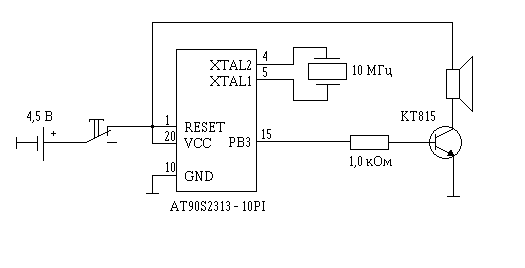

# Музыкальный звонок
## Краткое описание
Эта схема музыкального звонка собрана на микроконтроллере, может быть это похоже на "забивание гвоздей логарифмической линейкой", тем не менее у нее есть некоторые преимущества. Во первых используется всего одна микросхема, благодаря чему кроме традиционных преимуществ вроде увеличения надежности, уменьшения потребления энергии, появляется принципиальная возможность разместить всю схему в очень небольшом объеме, например оформив в виде музыкальной поздравительной открытки.
## Схема

Благодаря использованию микроконтроллера схема предельно упрощается, необходимо только подключить питание (от 2,7 до 6 вольт), кварцевый резонатор и если необходимо усилитель низкой частоты, собранный на транзисторе КТ815. Если предполагается что ток через нагрузку не будет превышать 20 мА, (например при использовании пьезоизлучателя), можно обойтись без усилителя. Следует заметить, что 20 мА, это максимальный ток логического _нуля_, то есть второй вывод звукового излучателя следует подключать к плюсу питания. Кнопка звонка должна иметь нормально замкнутые контакты, при нажатии на нее схема обесточивается, а при отпускании на нее подается питание и происходит автоматический сброс микроконтроллера. Сразу же после сброса начинает работать программа проигрывающая заданную мелодию. После завершения мелодии микроконтроллер переходит в режим пониженного энергопотребления "Power Down" и находится в нем до следующего нажатия на кнопку. Частоту кварца можно выбрать практически любую в диапазоне от 32768 кГц до 10 МГц. Схема была проверена на частоте 10 МГц, если Вы хотите использовать кварц на меньшую частоту (при этом уменьшится и потребляемый ток схемы), необходимо пропорционально уменьшить коэффициенты таблицы SoundTab и длительности звучания всех нот.
## Программа
Эта программа написана на ассемблере для AT90S2313 (аналог ATtiny2313),
таблица нот рассчитана для работы процессора на частоте 10 МГц, вместо мелодии
используется проигрывание гаммы от более низких нот к более высоким и обратно.
Конкретную мелодию звонка предлагается выбрать пользователю при сборке устройства
и внести её в таблицу вместо гаммы.

Статья об этом устройстве опубликована в книге М.Голубцова "Микроконтроллеры AVR от простого к сложному".

